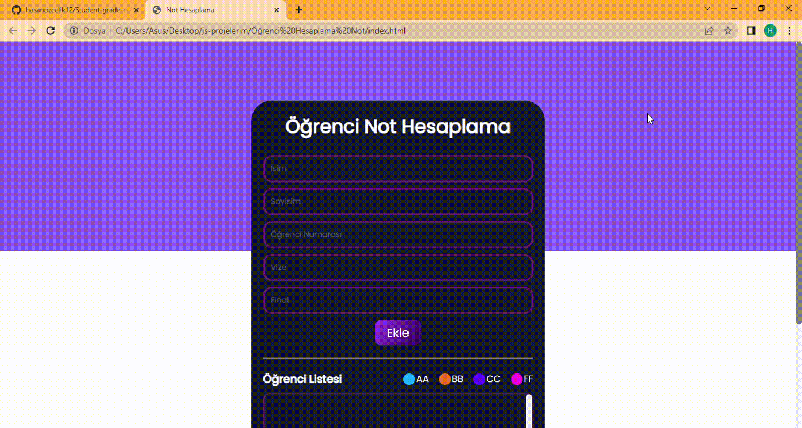

It is a project that includes the student's name, surname and number, 
finds the average according to the grades received and
shows the letter grade according to this average

## What was used in the project ?
• ES5 and ES6 functions
• getItem and setItem used with localStorage
• Update and access operations were performed by accessing HTML elements with DOM structure.
• Created notification screen with Toastify library

## Screen

